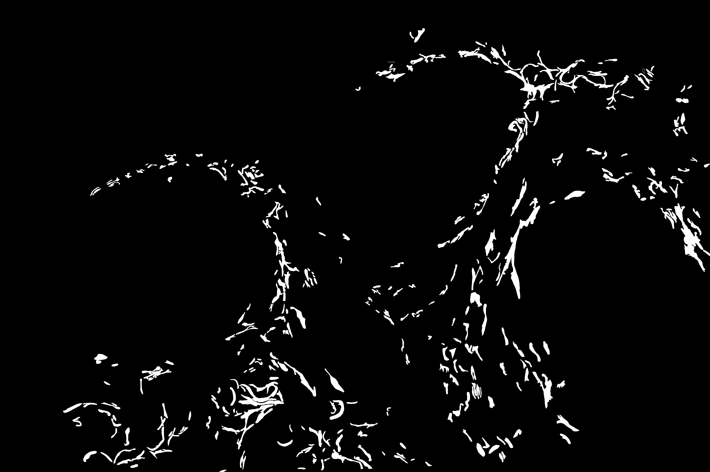
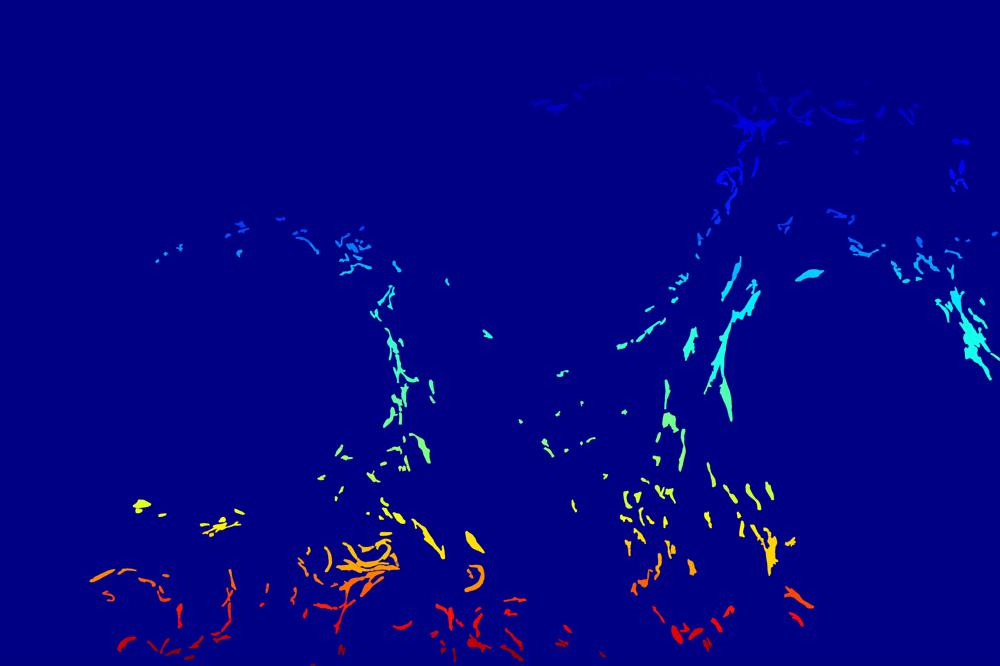

# Microscopy Breast Cancer Classification & Segmentation project


## Requirements

* Python3.7
* PyTorch: 1.1.0
* Packages: torch, numpy, tqdm 

## Cls:
bin/trainval_cls.py

## Documents of segmented labels(Watershed)

For better labeling, each mask segmentation label is further processed, each organelle in a mask label is labeled
 with a specific number (reference [watershed](https://docs.opencv.org/3.3.1/d3/db4/tutorial_py_watershed.html) in
  OpenCV)
  
Here are some example:
### S1 cytoskeleton



### T4R Mitochondria Light


In the above examples, the first is the original mask segmentation, and the second is the [JET](https://docs.opencv.org/master/d3/d50/group__imgproc__colormap.html) colormap image which
 have been normalized. Each color matches a specific number, so you can se that the background is blue because in the
  np array the background pixel is labeled as 1. So you can get the number of all organelles or the mask image via np
  .max(array)-1
  
  In the data.zip I have uploaded, you can see I have saved the JIT(JET) png image for reference, and a .npy binary
   file that is the saved numpy array of the marker. So you can load the marker via np.load() and get a specific
    organelle in that image via array[array==i].
    
Here is an example code:

```python
import cv2
import os, sys
from PIL import Image
import matplotlib.pyplot as plt
import numpy as np
file_name = 'CL_T4R_180807_01_Cytoskeleton.npy'

marker = np.load(file_name) # load marker array
raw_img = cv2.imread('S1_Helios_1of3_v1010.png')
print('number of organelles in the marker: {}'.format(np.max(marker)-1))

raw_img[marker>=2] = [0,0,255] # label all organelles to red
cv2.imshow('img',raw_img)
```

result:

